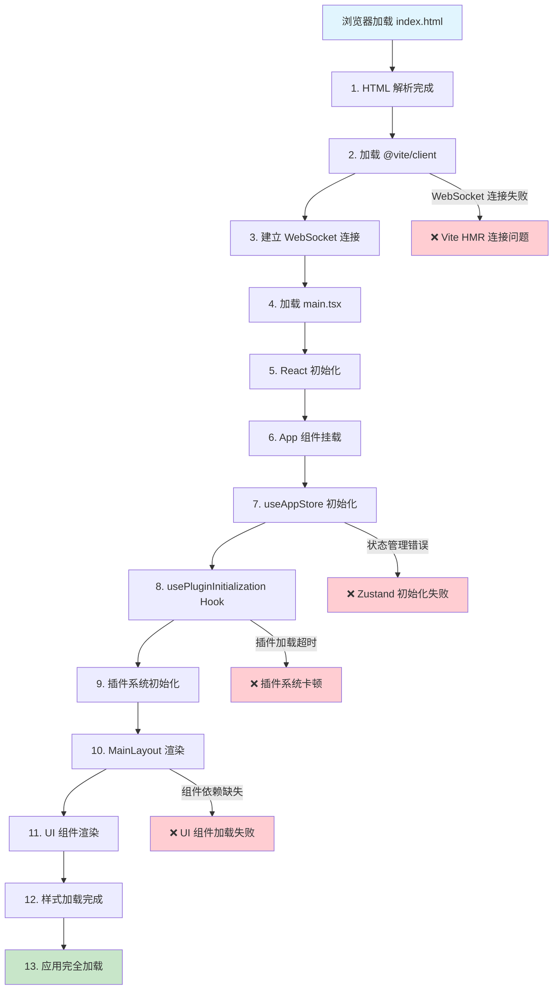

# LifeBox 前端加载流程图

## 关键加载点说明

1. **HTML 解析** - 基础 DOM 结构
2. **Vite Client** - 开发服务器热更新客户端
3. **WebSocket 连接** - HMR 实时更新连接
4. **main.tsx** - React 应用入口
5. **React 初始化** - React 核心库加载
6. **App 组件** - 根组件挂载
7. **useAppStore** - Zustand 状态管理
8. **usePluginInitialization** - 插件系统 Hook
9. **插件系统初始化** - 动态插件加载
10. **MainLayout** - 主布局组件
11. **UI 组件** - shadcn/ui 组件渲染
12. **样式加载** - CSS 和 Tailwind 样式
13. **应用完全加载** - 所有资源加载完成

## 常见卡顿原因

- **WebSocket 连接失败**: Vite HMR 连接问题
- **插件系统超时**: 插件加载或初始化异常
- **状态管理错误**: Zustand store 初始化失败
- **组件依赖缺失**: UI 组件或样式加载问题